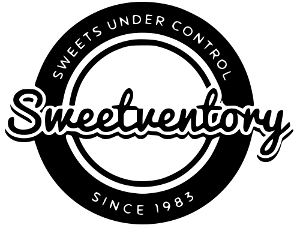

<div align="center">



# 📦 Web Inventory & Production Simulation

*A robust and complete ERP application for managing raw materials, products, and advanced production optimization to maximize revenue. Built with Angular and Spring Boot.*

[](https://angular.io/)
[](https://spring.io/projects/spring-boot)
[](https://www.typescriptlang.org/)
[](https://getbootstrap.com/)

</div>

---

## 📌 Overview

**Web Inventory/"Candy" - Sweetventory** is a complete business solution designed to simplify inventory management and optimize manufacturing operations. It goes beyond simple CRUD operations, offering **advanced production simulations**, calculating maximum production capacities based on current inventory and optimizing production queues to maximize revenue and minimize constraints by identifying limiting material(s) for higher revenue.

## ✨ Key Features

<picture>
    <source media="(prefers-color-scheme: dark)" srcset="inventory-web/src/assets/images/icons/graph-up-arrow-white.svg">
    
  </picture><strong> Interactive Dashboard:</strong> Get a bird's-eye view of your business with high-level metrics and intuitive charts.

<picture>
    <source media="(prefers-color-scheme: dark)" srcset="inventory-web/src/assets/images/icons/basket-white.svg">
    
  </picture><strong> Raw Materials Management:</strong> Keep track of stock levels, units of measurement, and acquisition alerts.

<picture>
    <source media="(prefers-color-scheme: dark)" srcset="inventory-web/src/assets/images/icons/box-seam-white.svg">
    
  </picture><strong> Product Composition:</strong> Build products using detailed recipes and measurement conversions.

<picture>
    <source media="(prefers-color-scheme: dark)" srcset="inventory-web/src/assets/images/icons/graph-up-white.svg">
    
  </picture><strong> Maximum Production Module:</strong> Instantly calculate how many units of a specific product can be manufactured before running out of limiting ingredients.

<picture>
    <source media="(prefers-color-scheme: dark)" srcset="inventory-web/src/assets/images/icons/speedometer-white.svg">
    
  </picture><strong> Production Optimization:</strong> Intelligent algorithms that analyze current inventory to suggest the most profitable production strategy.

<picture>
    <source media="(prefers-color-scheme: dark)" srcset="inventory-web/src/assets/images/icons/diagram-3-white.svg">
    
  </picture><strong> Simulation Dashboard:</strong> Test hypothetical scenarios without affecting actual data to forecast production bottlenecks.

## 🛠️ Technology Stack

**Frontend:**
- Angular 17+
- TypeScript
- RxJS
- Bootstrap 5 (Responsive UI)
- SCSS for styling

**Backend:**
- Java 21
- Spring Boot 3
- Spring Data JPA / Hibernate
- PostgreSQL
- RESTful APIs

---

## 🚀 Getting Started

Follow these steps to run the frontend application in your local development environment.

### Prerequisites
- [Node.js](https://nodejs.org/) (v18+)
- [Angular CLI](https://angular.dev/tools/cli) installed globally (`npm install -g @angular/cli`)

### Installation

1. **Clone the repository:**
   ```bash
   git clone https://github.com/your-username/inventory-web.git
   cd inventory-web
   ```

2. **Install dependencies:**
   ```bash
   npm install
   ```

3. **Start the Development Server:**
   ```bash
   ng serve
   ```

4. **Access the application:**
   Open your browser and navigate to `http://localhost:4200/`. The app will automatically reload if you change any of the source files.

---

## 📱 Interface Previews

*(Here you can add screenshots of your application in the future!)*

- **Dashboard**: ``
- **Production Optimization**: ``

---

## 🧪 Testing & Quality Assurance

Both frontend and backend are thoroughly tested using isolated unit tests with mocked dependencies to ensure code reliability and system stability. **All test suites for both environments have been executed and passed successfully (100% Green)!** ✅

**Frontend Testing (Angular):**
- **Framework & Runner:** Jasmine via Karma
- **Strategy:** Components and Services are extensively tested with fully mocked dependencies and API calls.
- **Command:** `ng test`

**Backend Testing (Spring Boot):**
- **Framework:** JUnit 5
- **Mocking:** Mockito
- **Strategy:** REST controllers, repositories, and business services are tested in isolation using strict mock injections to guarantee predictable outcomes and edge-case handling.
- **Command:** `./mvnw test`

---

## 🤝 Contributing

We welcome contributions! Feel free to:
1. Fork the project.
2. Create your Feature Branch (`git checkout -b feature/AmazingFeature`).
3. Commit your changes (`git commit -m 'Add some AmazingFeature'`).
4. Push to the Branch (`git push origin feature/AmazingFeature`).
5. Open a Pull Request.

---

Feedback
If you have any feedback, please let me know via the box. daniel.p.nasciment@gmail.com

---

## 🔗 Links

- [Portfolio](https://danielpnascimento.github.io)

---

<div align="center">
  <b>Developed with by [Daniel Nascimento](https://danielpnascimento.github.io)</b>
</div>
